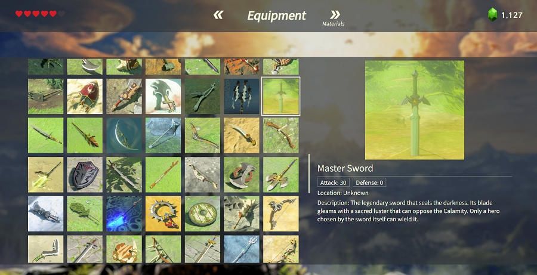
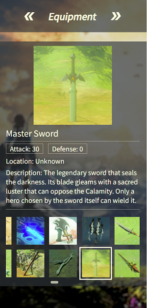

# Breath of the Wild Encyclopedia

  

<a href='https://monysary.github.io/Breath-of-the-Wild-Encyclopedia/' target='_blank'>Click here</a> to check it out!

## Description
In celebration of the new Legend of Zelda: Tears of the Kingdom release in May 2023, I've created this online encyclopedia as a way for LoZ fans to view BOTW in-game materials and items with UI inspired by the BOTW in-game item menu. The encyclopedia features the following information from the game:
- Equipments
- Materials
- Treasures
- Creatures
- Monsters

## Usage
Users can navigate between each in-game category by selecting the left and right double arrow icons on the header. The first item on the list will be automatically selected and have its detailed information populated. Selecting item icons in the left hand side (bottom side for mobile view) will populate that item's detailed information.

## Screenshots
Desktop View  
  

Mobile View  
  

## Technology
This web app was built using React and some components from the Material UI library. Data for the encyclopedia was obtained from the Hyrule Compendium API.

## Credit
<a href='https://gadhagod.github.io/Hyrule-Compendium-API/#/' target='_blank'>Hyrule Compendium API</a>

## Disclaimer
I do not own nor am affiliated in any way with the Legend of Zelda series. I made this purely for fun and for the love the series, I do not plan to monetize this app or sell it off. This app was also only made possible with the help of the Hyrule Compendium API, I do not own nor created any of the images and information displayed in the encyclopedia.

## How to contribute
If you'd like to contribute to this app, please contact me at sary.mony@gmail.com and let's collaborate!